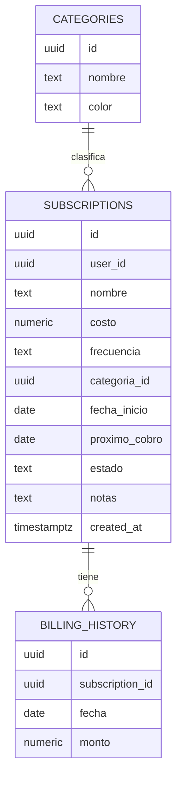
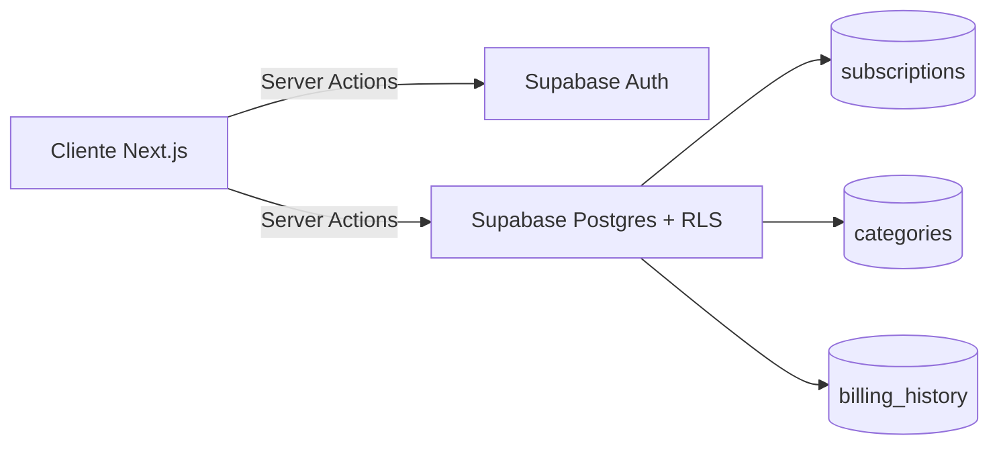

# SaaS-Track

<!-- [TODO - Etapa 8] Reemplazar TU_USUARIO/TU_REPO por los reales y descomentar
una vez que el workflow de CI esté configurado y haya corrido al menos una vez:

-->

## ¿Qué es SaaS-Track?

SaaS-Track es una aplicación web para registrar, gestionar y visualizar
suscripciones recurrentes (streaming, software, gimnasio, herramientas
de trabajo, etc.) en un solo lugar.

Resuelve un problema simple pero común: perder de vista cuánto se gasta
en total por mes en servicios recurrentes, y cuándo corresponde cada
próximo cobro. La app centraliza esa información, calcula el gasto
mensual normalizado (sin importar si una suscripción es mensual, anual
o semanal) y muestra los próximos vencimientos de forma clara.

Cada usuario gestiona únicamente sus propias suscripciones — el acceso
está aislado por usuario mediante autenticación y Row Level Security
en la base de datos.

## Funcionalidades

- Autenticación con email y contraseña (Supabase Auth)
- Dashboard con gasto mensual total, gráfico de gasto por categoría y
  lista de próximos vencimientos (7 días)
- Gestión de suscripciones: crear, editar, pausar, cancelar y eliminar,
  con búsqueda y filtros por categoría/estado
- Vista de detalle de cada suscripción con su historial de cobros
- Carga de datos de ejemplo con un click, para ver la app funcionando
  sin necesidad de ingresar datos a mano

## Arquitectura y stack

| Capa | Tecnología | Por qué |
|---|---|---|
| Frontend | Next.js 14+ (App Router) + TypeScript | Server Components + Server Actions permiten mantener la lógica de mutaciones cerca del servidor sin exponer lógica innecesaria al cliente |
| UI | Tailwind CSS + shadcn/ui | Componentes accesibles y consistentes sin reinventar diseño base |
| Gráficos | Tremor | Componentes pensados específicamente para dashboards, evita construir gráficos desde cero |
| Backend / DB | Supabase (Postgres + Auth + Row Level Security) | BaaS recomendado por el challenge; RLS permite aislar datos por usuario directamente en la base, sin depender solo de lógica de frontend |
| Fechas | date-fns | Evita cálculo manual de fechas (fin de mes, años bisiestos) |
| Tests | Vitest | Tests rápidos para la lógica de negocio pura |
| Deploy | Vercel | Integración nativa con Next.js |

La lógica de negocio (cálculo de próximo cobro, normalización de costos
a valor mensual) vive aislada en `src/lib/billing`, sin dependencias de
Supabase ni de React — esto permite testearla de forma aislada y
reutilizarla tanto en server actions como en cualquier otra capa futura.

> El detalle completo de decisiones de arquitectura, modelo de datos
> y fases de implementación está documentado en
> [`docs/superpowers/specs/design.md`](./docs/superpowers/specs/design.md)

## Estructura del proyecto

```
src/
├── app/                    # Rutas, layouts y composición de pantallas
├── lib/
│   ├── billing/             # Lógica pura de negocio (testeada con Vitest)
│   └── supabase/            # Clientes Supabase (server/browser) y helpers de sesión
├── features/
│   ├── subscriptions/       # Acciones, queries, tipos y componentes de suscripciones
│   └── dashboard/            # Componentes y cálculos de presentación del dashboard
├── components/ui/           # Componentes shadcn/ui
└── test/                    # Configuración y utilidades de Vitest

supabase/
└── migrations/              # Esquema SQL, políticas RLS y seed de categorías

docs/
└── design.md                # Documento de diseño y arquitectura detallado
```

## Modelo de datos





## Seguridad (Row Level Security)

La tabla `subscriptions` tiene RLS habilitado con políticas que
restringen cada operación (`select`, `insert`, `update`, `delete`) a
filas donde `auth.uid() = user_id`. La tabla `billing_history` también
tendrá RLS habilitado: sus políticas validarán con `exists (...)` contra
`subscriptions` para permitir acceso solo cuando el historial pertenezca
a una suscripción del usuario autenticado.
`categories` es un catálogo de lectura pública, sin necesidad de
restricción por usuario.

<!-- [TODO - Etapa 6] Completar esta sección con cómo probaste esto en
la práctica. Ejemplo: "Se verificó manualmente creando un segundo
usuario de prueba y confirmando que no puede ver ni modificar las
suscripciones del primero, ni mediante la UI ni llamando directamente
a la API de Supabase." -->

## Herramientas de IA utilizadas

<!-- [TODO - completar a medida que avanzás, no dejar para el final]

Ejemplo de qué incluir acá (sé específico, esto es lo que más pesa
en la evaluación del challenge):

- Qué herramienta usaste para cada parte (ej: Codex para scaffolding
  inicial y server actions, Claude para diseño de arquitectura y
  documentación)
- Qué te generó bien y aceleró de verdad
- Qué tuviste que corregir o auditar manualmente (esto es lo más
  importante de mostrar: tu criterio técnico sobre la salida de la IA)
- Algún ejemplo concreto de un bug o decisión que la IA no resolvió
  bien y cómo lo solucionaste vos
-->

## Tests

```bash
npm run test
```

Los tests cubrirán la lógica pura de `src/lib/billing`:
- `calcularProximoCobro` para frecuencias mensual, anual y semanal,
  incluyendo casos límite (fin de mes, años bisiestos)
- `normalizarAMensual` para las tres frecuencias soportadas
- Manejo de frecuencia inválida

<!-- [TODO - Etapa 2] Actualizar con la cantidad real de tests una vez escritos,
ej: "8 tests, todos passing" -->

## CI/CD

<!-- [TODO - Etapa 8, opcional] Descomentar y completar una vez configurado:

Cada push a `main` ejecuta automáticamente lint y tests vía GitHub
Actions (ver `.github/workflows/ci.yml`). -->

## Instalación y ejecución local

### Requisitos previos
- Node.js 20+
- Una cuenta y proyecto de Supabase

### Pasos

1. Clonar el repositorio
   ```bash
   git clone https://github.com/TU_USUARIO/TU_REPO.git
   cd TU_REPO
   ```

2. Instalar dependencias
   ```bash
   npm install
   ```

3. Configurar variables de entorno
   ```bash
   cp .env.local.example .env.local
   ```
   Completar `NEXT_PUBLIC_SUPABASE_URL` y `NEXT_PUBLIC_SUPABASE_ANON_KEY`
   con los datos de tu proyecto en [supabase.com](https://supabase.com).

4. Aplicar las migraciones
   - Ir al SQL Editor del proyecto de Supabase
   - Ejecutar el contenido de `supabase/migrations/` en orden
   - Esto crea las tablas, las políticas RLS y el seed de categorías

5. Correr el proyecto en modo desarrollo
   ```bash
   npm run dev
   ```

6. Abrir [http://localhost:3000](http://localhost:3000)

## Decisiones de scope

- **Una sola moneda (USD), sin conversión de divisas:** decisión
  consciente para priorizar la robustez y calidad del core en el
  tiempo disponible, en lugar de sumar superficie de fallo con
  integraciones externas. Una integración de tipo de cambio quedaría
  como evolución natural sin requerir cambios estructurales en el
  modelo de datos.
- **Sin notificaciones, pagos reales, multi-moneda ni cuentas
  compartidas:** fuera del alcance deliberado de este proyecto, para
  mantener el foco en un sistema acotado, terminado y bien ejecutado.

## Demo desplegada

<!-- [TODO - Etapa 9] Completar al deployar:
🔗 [Link a la demo en Vercel]

Para probar: registrate con cualquier email y usá el botón
"Cargar datos de ejemplo" en el dashboard vacío para ver la app
funcionando con datos realistas sin cargar nada a mano. -->

## Documentación adicional

- [`docs/superpowers/specs/design.md`](./docs/superpowers/specs/design.md) — documento de diseño y
  arquitectura detallado, con el modelo de datos completo, las fases
  de implementación y las decisiones técnicas justificadas.
