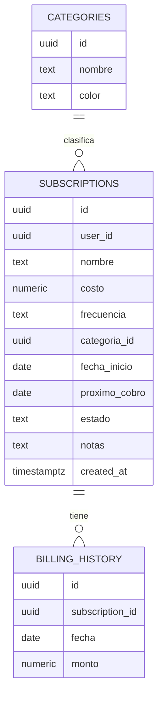
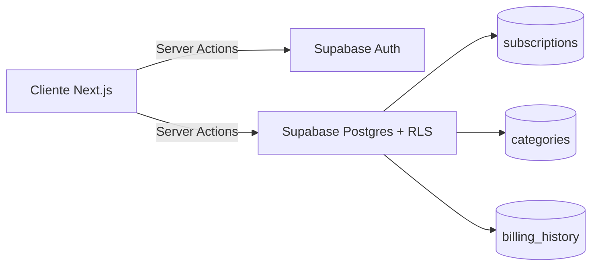

# SubTrack


## ¿Qué es SubTrack?

SubTrack es una aplicación web para registrar, gestionar y visualizar
suscripciones recurrentes (streaming, software, gimnasio, herramientas
de trabajo, etc.) en un solo lugar.

Resuelve un problema simple pero común: perder de vista cuánto se gasta
en total por mes en servicios recurrentes, y cuándo corresponde cada
próximo cobro. La app centraliza esa información, calcula el gasto
mensual normalizado (sin importar si una suscripción es mensual, anual
o semanal) y muestra los próximos vencimientos de forma clara.

Cada usuario gestiona únicamente sus propias suscripciones — el acceso
está aislado por usuario mediante autenticación y Row Level Security
en la base de datos.

## Funcionalidades

- Autenticación con email y contraseña (Supabase Auth)
- Dashboard con gasto mensual total, gráfico de gasto por categoría y
  lista de próximos vencimientos (7 días)
- Gestión de suscripciones: crear, editar, pausar, cancelar y eliminar,
  con búsqueda y filtros por categoría y estado
- Vista de detalle de cada suscripción con su historial de cobros
- Carga de datos de ejemplo con un click, para ver la app funcionando
  sin necesidad de ingresar datos a mano

## Arquitectura y stack

| Capa | Tecnología | Por qué |
|---|---|---|
| Frontend | Next.js 14+ (App Router) + TypeScript | Server Components + Server Actions permiten mantener la lógica de mutaciones cerca del servidor sin exponer lógica innecesaria al cliente |
| UI | Tailwind CSS + shadcn/ui | Componentes accesibles y consistentes sin reinventar diseño base |
| Gráficos | Tremor | Componentes pensados específicamente para dashboards, evita construir gráficos desde cero |
| Backend / DB | Supabase (Postgres + Auth + Row Level Security) | BaaS recomendado por el challenge; RLS permite aislar datos por usuario directamente en la base, sin depender solo de lógica de frontend |
| Fechas | date-fns | Evita cálculo manual de fechas (fin de mes, años bisiestos) |
| Tests | Vitest | Tests rápidos para la lógica de negocio pura |
| Deploy | Vercel | Integración nativa con Next.js |

La lógica de negocio (cálculo de próximo cobro, normalización de costos
a valor mensual) vive aislada en `src/lib/billing`, sin dependencias de
Supabase ni de React — esto permite testearla de forma aislada y
reutilizarla tanto en server actions como en cualquier otra capa futura.

> El detalle completo de decisiones de arquitectura, modelo de datos
> y fases de implementación está documentado en
> [`docs/design.md`](./docs/design.md)

## Estructura del proyecto

```
src/
├── app/                         # Rutas, layouts, server actions y estados de carga (Next.js App Router)
│   ├── auth/                    # Callback de confirmación de Supabase Auth
│   ├── dashboard/
│   │   ├── subscriptions/
│   │   │   ├── [id]/            # Ruta de detalle de una suscripción
│   │   │   ├── actions.ts       # Server actions (crear, editar, pausar, eliminar)
│   │   │   ├── page.tsx
│   │   │   └── loading.tsx
│   │   ├── actions.ts           # Server actions del dashboard (ej. cargar datos de ejemplo)
│   │   ├── dashboard-nav.tsx
│   │   ├── layout.tsx
│   │   └── page.tsx
│   ├── login/                   # Login y registro
│   ├── globals.css
│   ├── layout.tsx
│   └── page.tsx
├── features/                    # Componentes de UI reutilizables, agrupados por dominio
│   ├── subscriptions/           # Formulario y listado/tabla de suscripciones
│   └── dashboard/               # KPIs, gráfico de gasto por categoría, próximos vencimientos
├── lib/                         # Lógica de negocio y acceso a datos, sin JSX
│   ├── billing/                 # Cálculo de próximo cobro y normalización a valor mensual (testeada con Vitest)
│   ├── subscriptions/           # Queries a Supabase y validación/armado de payload de formulario
│   ├── supabase/                # Clientes Supabase (server/browser) y helpers de sesión
│   ├── auth-errors.ts
│   └── utils.ts
├── components/ui/               # Componentes shadcn/ui
└── types/
    └── index.ts                 # Tipos compartidos del dominio

middleware.ts                    # Protección de rutas / refresh de sesión Supabase

supabase/
└── migrations/                    # Esquema SQL, políticas RLS y seed de categorías


docs/
├── design.md               # Documento de diseño y arquitectura detallado
└── ai-log.md               # Bitácora de uso de IA durante el desarrollo
```

## Modelo de datos





## Seguridad (Row Level Security)

La tabla `subscriptions` tiene RLS habilitado con políticas que
restringen cada operación (`select`, `insert`, `update`, `delete`) a
filas donde `auth.uid() = user_id`. La tabla `billing_history` tiene
RLS habilitado con políticas que validan con `exists (...)` contra
`subscriptions`, permitiendo acceso solo cuando el historial pertenezca
a una suscripción del usuario autenticado. `categories` es un catálogo
de lectura pública sin restricción por usuario.

Se verificó manualmente registrando un segundo usuario de prueba y
confirmando que no puede ver ni modificar las suscripciones del primero,
ni mediante la UI ni llamando directamente a la API de Supabase con el
token del segundo usuario.

## Herramientas de IA utilizadas

El desarrollo usó **Claude** para diseño de arquitectura y documentación, y **GitHub Copilot / Codex** para generación de código (scaffolding, server actions, componentes, tests).

El flujo de trabajo fue iterativo: Claude definía el plan, Codex generaba el código, y yo definía las
decisiones de diseño, auditaba cada
entrega antes de integrarla y corregía lo que no funcionaba y
descartana lo que la IA no resolvió bien.

**Ejemplos concretos de correcciones sobre salidas de IA:**

- **globals.css con import roto:** Codex generó `@import "shadcn/tailwind.css"`, que no existe. Rompía la generación de CSS sin tirar error explícito, solo un 404 silencioso en `/_next/static/css`. Lo detecté revisando el log del dev server y lo eliminé.

- **Mismatch Tailwind v3/v4:** Los componentes de shadcn generados usaban sintaxis de Tailwind v4 (`data-active:`, `group-data-horizontal/`) incompatible con v3 instalado. Intenté migrar a v4 pero generó conflictos en node_modules. Solución: mantener v3 y reescribir los componentes afectados con sintaxis estándar (`data-[state=active]:`).

- **signOut con tipo de retorno incorrecto:** Codex generó `signOut` retornando `Promise<ActionResult>`, pero Next.js espera `void` en form actions directas. Cambié el tipo y eliminé el return.

- **Falta de ruta /auth/callback:** Sin esta ruta, el registro redirigía a `/?code=...` en vez de al dashboard. Codex no la incluyó en el scaffolding inicial; la agregué con el handler de `exchangeCodeForSession`.

- **GRANTs faltantes en el esquema SQL:** La migración habilitaba RLS y creaba las policies, pero faltaban los `GRANT` para el rol `authenticated`. Resultado: `permission denied for table subscriptions` al primer request real. Detectado integrando el dashboard con datos reales.

- **Búsqueda con server action en cada tecla:** Codex implementó la búsqueda de suscripciones disparando una Server Action por cada keystroke, generando decenas de requests consecutivos. Lo corregí moviendo el filtro a `useState + .filter()` client-side sobre los datos ya cargados.

- **Hydration error en DropdownMenu:** `ActionsMenu` definido como componente inline causaba mismatch de hydration porque Radix genera IDs de SVG random en SSR que no coinciden en cliente. Solución: mount guard con `useState(false) + useEffect`.

- **Tests de billing demasiado débiles:** Los tests generados solo verificaban "es una fecha futura" con `Date.now()`, sin detectar bugs en el cálculo real. Los reescribí usando `vi.setSystemTime()` para fijar una fecha conocida y verificar el resultado exacto esperado.

- **DonutChart colors en Tremor v3:** Tremor no acepta hex en la prop `colors`; si no reconoce el valor cae a negro. Solución: `COLOR_MAP` hex→nombre-Tremor para el donut, y `TREMOR_TO_HEX` inverso en el `customTooltip` para recuperar el hex original al renderizar.

## Tests

```bash
npm run test
```

El proyecto tiene tests unitarios para la lógica pura de `src/lib/billing`
y tests de componentes y cálculos del dashboard.

Áreas cubiertas:
- `calcularProximoCobro` para frecuencias mensual, anual y semanal,
  incluyendo casos límite con `vi.setSystemTime()` para verificar
  resultados exactos
- `normalizarAMensual` para las tres frecuencias
- Manejo de frecuencia inválida
- `calcularGastoMensualTotal` y `calcularGastoPorCategoria` con casos
  borde (sin suscripciones activas, sin categoría asignada)
- Componentes de presentación: `KpiCard`, `ProximosVencimientos`,
  `EmptyDashboard`, wrappers de Radix UI

## CI/CD

Cada push a `main` ejecuta automáticamente lint, tests y build de
producción vía GitHub Actions (ver `.github/workflows/ci.yml`).

El build de producción corre con las variables de entorno de Supabase
inyectadas como secrets del repositorio, verificando que la app compila
correctamente en un entorno limpio antes de cada merge.

## Instalación y ejecución local

### Requisitos previos
- Node.js 20+
- Una cuenta y proyecto de Supabase

### Pasos

1. Clonar el repositorio
   ```bash
   git clone https://github.com/sofigandulfo/challenge-tecnico.git
   cd challenge-tecnico
   ```

2. Instalar dependencias
   ```bash
   npm install
   ```

3. Configurar variables de entorno
   ```bash
   cp .env.local.example .env.local
   ```
   Completar `NEXT_PUBLIC_SUPABASE_URL` y `NEXT_PUBLIC_SUPABASE_ANON_KEY`
   con los datos de tu proyecto en [supabase.com](https://supabase.com).

4. Aplicar las migraciones
   - Ir al SQL Editor del proyecto de Supabase
   - Ejecutar el contenido de `supabase/migrations/` en orden
   - Esto crea las tablas, las políticas RLS, los GRANTs necesarios
     y el seed de categorías

5. Correr el proyecto en modo desarrollo
   ```bash
   npm run dev
   ```

6. Abrir [http://localhost:3000](http://localhost:3000)

## Decisiones de scope

- **Una sola moneda (USD), sin conversión de divisas:** decisión
  consciente para priorizar la robustez y calidad del core en el
  tiempo disponible, en lugar de sumar superficie de fallo con
  integraciones externas. Una integración de tipo de cambio quedaría
  como evolución natural sin requerir cambios estructurales en el
  modelo de datos.
- **Sin notificaciones, pagos reales, multi-moneda ni cuentas
  compartidas:** fuera del alcance deliberado de este proyecto, para
  mantener el foco en un sistema acotado, terminado y bien ejecutado.
- **Historial de cobros generado retroactivamente:** como la app no
  procesa pagos reales, el historial se calcula a partir de la fecha
  de inicio y la frecuencia. Si no hay filas en la tabla, se genera
  al vuelo como respaldo para que la vista nunca quede vacía por un
  proceso externo que no existe.

## Demo desplegada

🔗 [https://challenge-tecnico.vercel.app](https://challenge-tecnico.vercel.app)

Para probar: registrate con cualquier email y contraseña, y usá el
botón **"Cargar datos de ejemplo"** en el dashboard vacío para ver la
app funcionando con datos realistas sin cargar nada a mano.

## Documentación adicional

- [`docs/design.md`](./docs/design.md) — documento de diseño y
  arquitectura detallado, con el modelo de datos completo, las fases
  de implementación y las decisiones técnicas justificadas.
- [`docs/ai-log.md`](./docs/ai-log.md) — bitácora completa del uso
  de IA durante el desarrollo, con ejemplos concretos de correcciones
  y decisiones tomadas sobre las salidas generadas.